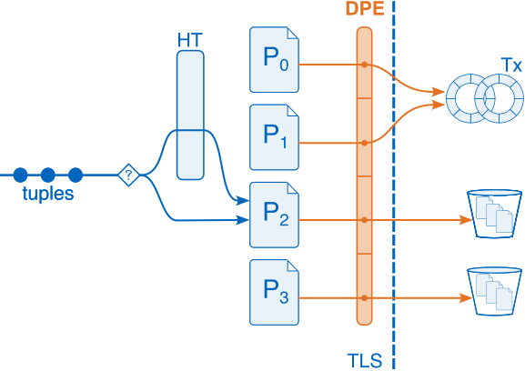

<div align="center">
<h1> ⚡ Adaptive Aggregations </h1>



<h6>
This repository contains the source code of my Master's Thesis titled:
</h6>
<div align="center">
<i>"Efficient and Adaptive Aggregations for Cloud-Based Analytical Systems".</i>
</div>

<h6>
The core implementation is an aggregation operator capable of scaling out <i>on-the-fly 🪽</i>.
<br>
That is, the query engine might scale out <i>mid-execution</i>.
</h6>
</div>

---

### 📁 Structure

```
📂
├── adaptive-aggregation/
├── analysis/
├── configs/
...
├── micro-benchmarks/
│   ├── aggregation/
│   └── shuffle/
└── Makefile
```

---
### 🏗️ Infrastructure

The multi-node benchmarks in this repo can be run either on a single machine (e.g.: multiple terminals + loop-back interface) or in a distributed setting.
<br>
An EC2 cluster in AWS can be setup using the following repo: [ec2-cluster](https://github.com/abdelrahman-0/ec2-cluster).  

In what follows, we refer to a <b>node</b> as a terminal window (for both single/multiple machines).

Each node should be assigned a serially-increasing <code>NODE_ID</code>, starting with id 0 for the first node, and so on:
```bash
export NODE_ID=0
```

Afterwards, a suitable configuration file must be set up to allow the nodes to communication with each other.
Have a look at the <code>[configs/](https://github.com/abdelrahman-0/adaptive-aggregations/tree/master/configs)</code> directory.


---

### 🔧 Installation & Setup

The repo's dependencies can be found in <code>install_deps.sh</code> and can be installed as follows: 
```bash
make install
```

⚠️ Note that some libraries are installed from source and might overwrite local installations (e.g. <code>liburing</code>).

This repo contains <b>2 shuffle</b> µbenchmarks (homogeneous,heterogeneous), <b>3 aggregation</b> µbenchmarks (local,homogeneous,heterogeneous), and the final <b>adaptive</b> implementation (coordinator,worker).

After installing the dependencies, you can build all targets using:
```bash
make all
```
or each target individually:
```bash
make shuffle
make aggregation
make adaptive
```

---

### 🛠️ Usage

The following examples show how to run the different targets with their specific parameters:

#### Shuffle

<code>shuffle_homogeneous</code>:
```bash
cd build-release/micro-benchmarks/shuffle
./shuffle_homogeneous --nodes=2 --config="../../../configs/local.json" --random --npages=100000 --groups=10 --partitions=64 --threads=8
```

<code>shuffle_heterogeneous</code>:
```bash
cd build-release/micro-benchmarks/shuffle
./shuffle_heterogeneous --nodes=4 --config="../../../configs/local.json" --random --npages=100000 --groups=10 --partitions=64 --nthreads=3 --qthreads=6
```

#### Aggregation (Single-Node)

<code>aggregation_local</code>:
```bash
cd build-release/micro-benchmarks/aggregation
./aggregation_local --random --npages=100000 --groups=10 --partitions=64 --threads=8
```

#### Aggregation (Multi-Node)

<code>aggregation_homogeneous</code>:
```bash
cd build-release/micro-benchmarks/aggregation
./aggregation_homogeneous --nodes=4 --config="../../../configs/local.json" --random --npages=100000 --groups=10 --partitions=64 --threads=8
```

<code>aggregation_heterogeneous</code>:
```bash
cd build-release/micro-benchmarks/aggregation
./aggregation_heterogeneous --nodes=4 --config="../../../configs/local.json" --random --npages=100000 --groups=10 --partitions=64 --nthreads=3 --qthreads=6
```

#### Adaptive

For the adaptive implementation, the coordinator node needs to be run first:
```bash
cd build-release/adaptive
./coordinator --nodes=4 --config="../../configs/local.json" --npages=100000
```
and then the workers (launched in the order described below):
```bash
cd build-release/adaptive
./worker --nodes=4 --config="../../configs/local.json" --npages=100000 --groups=100000 --threads=4 --policy="regression" --timeout=250
```

---

⚠️ For all targets (except <code>aggregation_local</code>), the executables need to be launched on the nodes according to their <b>decreasing</b> <code>NODE_ID</code>.
For instance, when running the <code>shuffle_homogeneous</code> target using a 4-node cluster, the target needs to be launched in the following order:
<div align="center">
<i>Launch <code>shuffle_homogeneous</code> on node 3, then node 2, then node 1, and finally node 0</i>.
</div>

This is necessary to avoid connection-deadlocks that arise when connecting nodes in a clique.

---

### 🚩 Common Flags
The following is a short list of command-line flags common between all targets:
<br>
<i>General Flags</i>
<br>
<code>--npages</code>: Number of 4 KiB input pages to generate
<br>
<code>--groups</code>: Number of unique groups that the generated input should have
<br>
<code>--morselsz</code>: Number of input pages that represent 1 morsel
<br>
<code>--threads</code>: Number of threads to use (for homogeneous/local targets)
<br>
<code>--qthreads/--nthreads</code>: Number of query-procesing/networking threads to use (for heterogeneous targets)
<br>
<code>--partitions</code>: Number of partitions to use
<br>
<code>--pin</code>: Whether to pin threads or not (<code>--nopin</code>)
<br>
<code>--htfactor</code>: Growth factor for global hashtable
<br>
<i>Output Flags</i>
<br>
<code>--csv</code>: Whether to print CSV output or a human-readable columnar format (<code>--nocsv</code>)
<br>
<code>--print_header</code>: Whether to print CSV header row or not (<code>--noprint_header</code>). Only applicable when <code>--csv</code> is used. 

⚠️ Note that the query metrics are output to <code>stderr</code>;
<br>
additional logging is output to <code>stdout</code> (pipe to <code>>/dev/null</code> to reduce clutter).


---

### ⚙️ Further Customization

Each target mentioned in the above <b>Usage</b> section has its own <code>definitions.h</code> header file serving as an entry point for further customization.

<u><i>Customize Input</i>:</u>
<br>
The header files contain a <code>TABLE_SCHEMA</code> macro definition that can be changed depending on the desired schema.
Additional comments in the definitions file specify further input-related customization macros.
This includes changing the aggregation key/value columns.

<u><i>Customize Hashtable</i>:</u>
<br>
The top-level [CMakeLists.txt](https://github.com/abdelrahman-0/adaptive-aggregations/blob/master/CMakeLists.txt#L32-L33) file contains two macros (<code>LOCAL_UNCHAINED_HT[16|32|64]</code> and <code>GLOBAL_UNCHAINED_HT</code>) that can be used to enable/disable unchained hashtables for both the local and global hashtables.
When disabled, the implementation defaults to chaining hashtables.

<u><i>Customize Aggregation Query</i>:</u>
<br>
For the non-shuffle targets, the aggregation query can be customized by changing the <code>fn_agg</code> and <code>fn_agg_concurrent</code> functions in the header files.

---

### 📊 Results

The performance results from the thesis can be found as CSV files in the <code>[analysis/](https://github.com/abdelrahman-0/adaptive-aggregations/tree/master/analysis)</code> directory.
